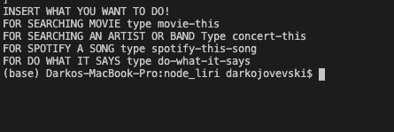
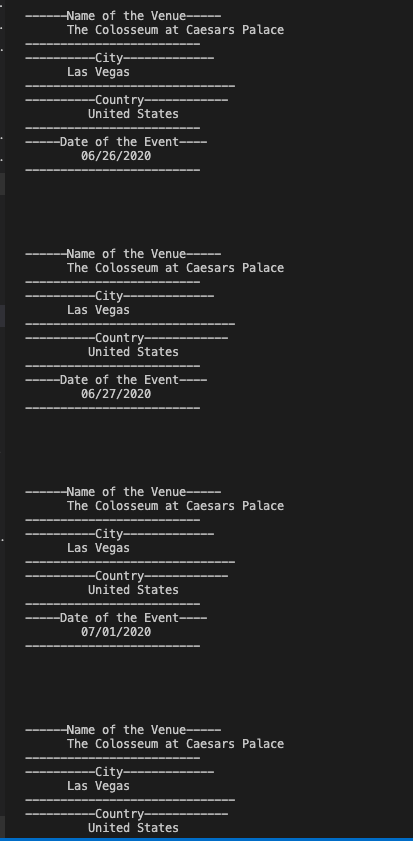
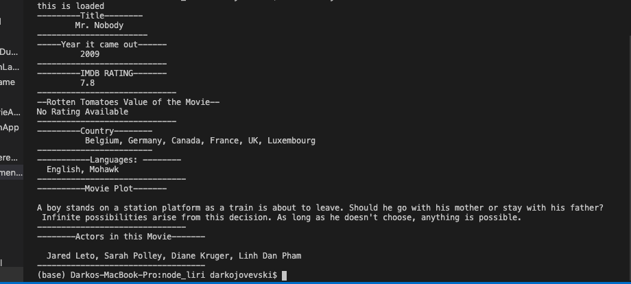

#  Liri APP NODE PROJECT

Welcome to my project Liri app that i created using node.js

## Liri app overview

What is Liri?!  Liri is an app similar to Siri but instead of voice comands it takes user input!
Liri can search for your favourite movie, favourite artists and their concerts and dates. Also can give you spotify link of some of the songs you want and name of the song!

You have all of this stuff under one program! You now can see where and when your favourite band is playing next and also see the IMDB rating of your favourite movie or maybe find some songs from your artist! 

It can save you time and effort to search individually for these things and gives you convinence!

### Below i will provide screenshots and instructions how to play around with this app!!

## Organization of the app:
I Organized the app by 4 main problem to solve!

At the begging i installed all of the modules i needed for the app and created input for typing it that we gonna use for later on! I created a separate variable for the input that the user is gonna type in order what to find!

After the  first part i started creating 4 different functions for each problem i needed to solve!
Every function is gonna be called upon command!
1. First function is gonna be callled when the user gonna type : concert-this
What this function is doing is that goes through BandsInTown Api and it gives us results from the object! It gives us Name of the Venue, Location and Date which i used moment to format it!

2. Second function is gonna be called is user gonna type: spotify-this-song
This function goes through node-spotify-api and it's able to gives us:
* Artists of the song
* Name of the song
* Preview link of the spotify
* The album that the song is from

3. Third function is gonna be called when user is gonna type: movie-this 
What this function gives us is going through OMDB api for movies and upon searching for the movie it give's us information about that movie like:
* Title
* Year it came out
* IMDB Rating
* Rotten Tomatos Value
* Country 
* Languages
* Plot 
* Actors

4. The fourth function is gonna be called when user is gonna type: do-what-it-says 
This will trigged fse module that is required and it will go through our random.txt document and it gonna take the date and put in into display

At the end i created switch that takes the variable i created for userinput and make 4 cases that gets triggered upon typing them and calling each individual function inside!

# Liri app is doing 4 commands:
## Upon default is gonna ask you in the program to type in something if you press enter blank

## You can choose to type: 
### concert-this
### spotify-this-song
### movie-this
### do-what-it-says

# By Default if we type in node liri.js it's gonna ask us to choose

##  node liri.js concert-this  <artist/band name  here>

### Here is screenshot of our search for band: Green Day

### Here is screenshot of our search for artist: Morissey

What this is doing is upon typing the command concert-this you can type the name of the artists or band and it will give you useful information what you need about your band or artists!

### Our result for Green Day search: 

### Our result for Morissey search:

## node liri.js spotify-this-song <song name here>

What this is doing is gives you information about the song you typed in! 
1. Name of Artists
2. Song's Name
3. Preview 30s link from spotify_url
4. The Album that the song is from

## node liri.js movie this <movie name here>

What this is doing is gives us information about the movie you searched! You can find info like:
* Title,
* Year,
* IMDB Rating
* Rotten Tomatoes,
* Country
* Language
* Plot ,
* Actors 

### If we don't put anything upon search it will gives us the default movie we set which is: Mr.Nobody

## node liri.js do-what-it-says 

What this is doing is takes the text from external file in this scenario my random.txt file and outputs them as a string and puts them into array!
With this we can see that we can access text from external file and use that to call function to gives us some info!

### In this case i haver rush hour movie into random.txt and that's why it will show up that movie! But we can do this with spotify-this-song and concert-this aswell!!!

Also i tried  for movie-this and it's working!! I just needed to create separte function that gets a parameter and it's been called within the function i need:

# Link to my delpoyed version of the app: https://platzmanfan.github.io/liri-node-app/

# Technologies:

## Moment.js to format Date
## fs to load external files
## dotenv 
## axios - which is htpp request that gave me OMDB API and BandsInTown API
## node-spotify-api  That gave me spotify search results

